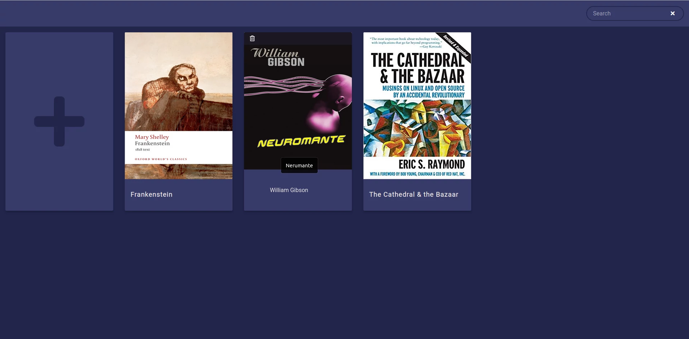

# Books Library




## Build

```
docker-compose build
```

## Run 

```
docker-compose up
```

Navigate to `localhost`

## Tech

  
 
 
 
 

## Todo

- [x] Allow multiple authors
- [ ] Search by author
- [x] Add book categories
